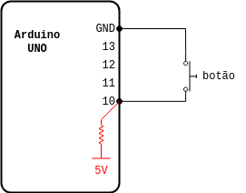

# Lendo o comando de um botão e ligando um Led com os registradores do ATmega328p :bulb:

README em construção :building_construction: ...

Aqui utilizaremos um Arduino Uno Rev.3.

Primeiro, listando as documentações aqui utilizadas:
1. Arduino Uno Rev. 3: :link: https://docs.arduino.cc/hardware/uno-rev3;
1. Biblioteca `avr/io.h`: :link: https://github.com/avrdudes/avr-libc/blob/main/include/avr/io.h;
1. Biblioteca `avr/portpins.h`: :link: https://github.com/avrdudes/avr-libc/blob/main/include/avr/portpins.h;
1. Biblioteca `util/delay.h`: :link: https://github.com/avrdudes/avr-libc/blob/main/include/util/delay.h.in
1. Datasheet ATmega328p: :link: https://ww1.microchip.com/downloads/en/DeviceDoc/Atmel-7810-Automotive-Microcontrollers-ATmega328P_Datasheet.pdf.

 
O pino que vamos utilizar é o D13, pois já possui conexão a um LED na própria placa do Arduino, e para ler o botão o D10. A seguir é mostrado um esboço das ligações entre os componentes:

 **OBS.:** na prática só ligamos mesmo o botão entre os pinos 10 e GND no Arduino. O que está destacado em vermelho é o resistor de *pull-up* que existe dentro do ATmega328p e iremos habilitá-lo via código. O valor desse resistor está na faixa entre 20 kΩ - 50 kΩ, conforme descreve a tabela da página 259 do *datasheet*

A referência para os registradores está na imagem a seguir:

  
perceba que o D13 está associado ao registrador PB5/PORTB5, e o D10 ao PB2/PORTB2  
**OBS.:** PB5 e PORTB5 se referem ao mesmo registrador no *datasheet* do ATmega328p. O mesmo é válido para PB2 e PORTB2.

Na página 72 do *datasheet* do ATmega328p vemos no detalhe os registradores em que estamos interessados:  

- PORTB: é o registrador onde controlaremos o sinal ON/OFF do pino do LED quando no caso do bit PORTB5/PB5. Esse mesmo registrador serviará para configurar um resistor de *pull-up* interno do Arduino para o bit PORTB2/PB2;
- DDRB: é o registrador que determina se determinado pino é de leitura ou escrita. Precisamos configurar os bits DDRB5/PB5 e DDRB2/PB2;
- PINB: é o registrador que utilizamos para ler dados das portas digitais. No nosso caso queremos ler do PINB2/PB2.

Então vamos ao código :man_technologist::

```c++
// Caso esteja utilizando a IDE do Arduino, essas bibliotecas são importadas automaticamente
#include <avr/io.h>
#include <util/delay.h>

#define LED_PIN PB5 // pino 13 no Arduino Uno 
#define BUTTON_PIN PB2 // pino 10 no Arduino Uno

#define SET_ONE_ON_BIT(register, bit) (register |= 1 << bit)
#define SET_ZERO_ON_BIT(register, bit) (register &= ~(1 << bit))

void mySetup() {
    
  SET_ONE_ON_BIT(DDRB, LED_PIN); // configura o pino como saída
    
  SET_ZERO_ON_BIT(DDRB, BUTTON_PIN); // configura o pino como entrada
  SET_ONE_ON_BIT(PORTB, BUTTON_PIN); // habilita o resistor de pull-up interno
}

uint8_t isButtonPressed() {
  return !(PINB & (1 << BUTTON_PIN));
}

int main(void) {
    
  mySetup();

  while (1) {
    if (isButtonPressed()) {
      SET_ONE_ON_BIT(PORTB, LED_PIN); // -> PORTB |= 1 << LED_PIN;
    } else {
      SET_ZERO_ON_BIT(PORTB, LED_PIN); // -> PORTB &= ~(1 << LED_PIN);
    }
    _delay_ms(100);
  }

  return 0;
}


```
Nesse código utilizamos muitas operações chamadas de *bitwise*, como `|`, `<<`, `&` e `~`. Caso não tenha familiaridade com essas operações da linguagem C, visite a página [Bitwise Operators in C/C++](https://www.geeksforgeeks.org/bitwise-operators-in-c-cpp/).

Explicando as partes mais importantes do código:
- `#define LED_PIN PB5` -> definindo uma macro para o PB5 para melhorar a legibilidade do código. Dá para trocar PB5 só por 5, pois no final a gente só quer a posição do bit. Na verdade PB5 já está definido como 5 na biblioteca `avr/portpins.h`, que é internamente incluída pela `avr/io.h`;
- `SET_PIN_AS_OUTPUT(DDRB, LED_PIN); // -> DDRB |= 1 << LED_PIN;` -> ou `DDRB = DDRB | 1 << LED_PIN` define o bit 5 como saída. No final essa operação nos dá em binário o valor `00100000` para o DDRB, isso está definindo o bit 5 do PORTB como saída;
- `SET_PIN_ON(PORTB, LED_PIN); // -> PORTB |= 1 << LED_PIN;` -> escreve nível lógico alto no bit 5 do PORTB, ou seja, liga o LED;
- `_delay_ms(500);` -> para a execução por 500 milissegundos. Essa função está definida na biblioteca `util/delay.h`;
- `SET_PIN_OFF(PORTB, LED_PIN); // -> PORTB &= ~(1 << LED_PIN);` -> escreve nível lógico baixo no bit 5 do PORTB, ou seja, desliga o LED.

# Contribuindo
Encontrou algum erro ou possui alguma sugestão? Abra uma *issue* com as suas considerações.